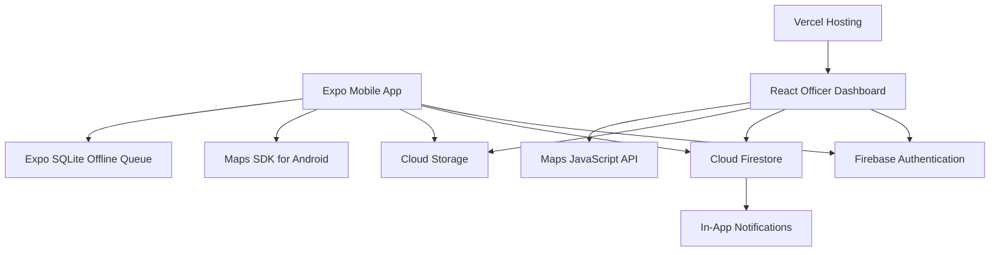

# Smart Disaster Early-Warning and Emergency Coordination System

## Complete Development Plan

**Implementation target:** React Native Expo mobile application, React web dashboard on Vercel, and direct Firebase/GCP services  
**Design basis:** Revised Group 036 critique and implementation report, with visual styling adapted from the Group 034 wireframes  
**Primary goal:** Implement a clear, demonstrable campus-level system that covers the four revised use cases without unnecessary production-level complexity.

---

## 0. Implementation status and decision log

### 0.1 Progress

| Phase | Status |
|---|---|
| Phase 0 — Freeze the implementation contract | ✅ Done — enums, models and constants in `packages/shared` |
| Phase 1 — Create the repository and applications | ✅ Done — npm workspaces, shared package, lint/format, env templates |
| Phase 2 — Configure the Firebase project | ✅ Done — both `.env` files verified; Firestore read/write and Storage upload/download/delete confirmed |
| Phase 3 — Shared schemas, rules and seed data | ⏳ Next |
| Phases 4–12 | Not started |

### 0.2 Decisions made during implementation

These decisions override anything later in this document that disagrees with them.

| # | Decision | Reason |
|---|---|---|
| D1 | **No Firebase CLI files and no Local Emulator Suite.** `firebase.json`, `.firebaserc`, `firestore.rules`, `storage.rules` and `firestore.indexes.json` are not kept in the repository. Rules and indexes are managed in the Firebase console. | Campus-level project; the extra tooling added complexity without assessment value. |
| D2 | **Both apps connect directly to the real Firebase project** using values in `apps/mobile/.env` and `apps/dashboard/.env`. There is no emulator switch. | Follows D1. |
| D3 | **Blaze plan is enabled** with a low budget alert. | Cloud Storage for Firebase requires Blaze for new default buckets (effective 3 Feb 2026) and Google Maps requires a billing account. Normal campus usage stays within no-cost allowances. |
| D4 | **Seed data is loaded with a Node script** (`npm run seed`) that uses the Firebase client SDK and the dashboard `.env`. No service-account key. | Works without emulators, re-runnable, no credentials to leak. |
| D5 | **Automated tests cover business logic and key components; end-to-end flows are a documented manual test checklist** with screenshots. | Avoids running automated tests against the real project. |
| D6 | **The Duty Officer links a hazard report to a disaster event when verifying it.** `hazardReports.disasterEventId` is optional and is set in the verification batch. | Accurate UC04 analytics without asking citizens to choose an event. |
| D7 | **The latest verification decision is copied onto the hazard report** (`latestDecision`) in the same batch. | Mobile *My Reports* can show the outcome and officer remarks without a second query. The `verificationDecisions` collection remains the audit record. |
| D8 | **Mobile routes live in `apps/mobile/src/app/`**, not `apps/mobile/app/`. | Default of the current Expo template (SDK 57) and its `AGENTS.md`. |
| D9 | **`app.config.ts` replaces `app.json`.** | Lets the Google Maps Android key come from `.env` instead of being committed. |
| D10 | **One React version across the monorepo** (`react@19.2.3`, the version Expo SDK 57 requires). The dashboard pins the same version and `@types/react` is pinned at the root. | Duplicate React copies cause runtime errors in Expo monorepos. |
| D11 | **Timestamps are ISO strings in the shared models.** Each app converts Firestore `Timestamp` ↔ ISO string in its mappers. | Models stay serialisable for SQLite, Zustand and JSON. |
| D12 | **Shared enums are `as const` arrays with derived union types**, not TypeScript `enum`. | Usable in dropdowns and `z.enum()`, and compatible with the dashboard's `erasableSyntaxOnly` setting. |
| D13 | **Pure business rules live in `packages/shared/src/rules/`** (capacity, shelter status, verification transitions, provisional/final decision, metric completeness). | Written and unit-tested once, used by both apps. |
| D14 | **Android package ID is `lk.lankashield.mobile`** (fixed; do not change after the first build). | The Google Maps Android key restriction and EAS credentials depend on it. |
| D15 | **The EAS project lives in the group's Expo organisation.** In Phase 4, set `owner: '<organisation-slug>'` in `app.config.ts`, then run `npx eas-cli@latest init` from `apps/mobile`. It cannot edit `app.config.ts` itself, so copy the `projectId` it prints into `extra.eas.projectId`. | Every group member can build under the shared organisation. |

### 0.3 Installed versions

Expo SDK 57 · React Native 0.86 · React 19.2.3 · TypeScript 6.0 · Vite 8 · Firebase JS SDK 12.19 · Node 22.

Expo changes between SDK releases. Check the versioned Expo documentation before using an Expo API, and install Expo packages with `npx expo install` from `apps/mobile`.

---

## 1. Final technical decision

Use two TypeScript front ends connected to one Firebase project:

- **Mobile:** React Native with Expo for citizens and community volunteers.
- **Web:** React with Vite for Duty Officers, District Officers and DMC Analysts.
- **Backend:** Firebase Authentication, Cloud Firestore and Cloud Storage accessed directly through the Firebase client SDK.
- **Maps:** Google Maps Platform using Maps SDK for Android and Maps JavaScript API.
- **Offline mobile queue:** Expo SQLite with explicit synchronisation states.
- **Deployment:** EAS Build for Android and Vercel for the web dashboard.
- **Cloud Functions:** Not required for the initial implementation. Add them later only if a feature cannot be implemented clearly with client SDK operations.

This gives the group familiar React concepts on both platforms while allowing each interface to use components appropriate to its device.

### 1.1 Scope priorities

| Priority | Scope |
|---|---|
| P0 — required | Authentication, role routing, submit hazard report, offline queue, verification, shelter management, analytics dashboard, Firebase data, screenshots and tests |
| P1 — important | Google Maps, evidence upload, in-app notifications, PDF export, meaningful error states and seed data |
| P2 — optional polish | Advanced map styling, animation, extensive filtering, multiple export formats and sophisticated notification preferences |

Do not begin P2 work until every P0 workflow can be demonstrated end to end.

---

## 2. System scope and actors

### 2.1 Actors

| Actor | Application | Main responsibilities |
|---|---|---|
| Citizen | Mobile | Submit hazard reports and track their status |
| Community Volunteer | Mobile | Submit reports with evidence and location |
| Duty Officer | Web | Review evidence and verify, reject or escalate reports |
| District Officer | Web | Register shelters, check capacity and allocate evacuees |
| DMC Analyst | Web | Generate, analyse, export and share disaster-response reports |
| Donor Organisation | External/mock | Receives authorised final reports |
| Notification Gateway | Firebase/Expo service | Delivers report results and warning-related notifications |

### 2.2 Revised use cases to implement

1. **UC01 — Submit Hazard Report**
2. **UC02 — Verify Hazard Report**
3. **UC03 — Manage Emergency Shelter**
4. **UC04 — Generate and Analyze Disaster Response Report**

### 2.3 Non-goals

- No real IoT devices are required; sensor information can be seeded or mocked.
- No machine-learning model is required.
- No microservices, Kubernetes or multiple databases.
- No iOS release is required unless time remains.
- No real SMS integration is required; display it as a mocked fallback channel.
- No production-grade disaster authority integration is required.

---

## 3. High-level architecture



### 3.1 Responsibility boundaries

- Front ends manage forms, navigation, loading states and presentation.
- Shared TypeScript types define the data contract.
- Firestore stores online application data.
- SQLite stores unsynchronised mobile reports and evidence metadata.
- The dashboard performs verification through Firestore batch writes and shelter allocation through Firestore transactions.
- The dashboard calculates analytics and creates PDF exports in the browser.
- Firestore notification documents provide the required notification workflow. Real remote push can be added later.
- Google Maps displays locations and lets users select or inspect coordinates.

---

## 4. Technology stack

### 4.1 Mobile application

| Concern | Technology |
|---|---|
| Framework | React Native with Expo and TypeScript |
| Navigation | Expo Router |
| UI components | React Native Paper |
| Forms | React Hook Form |
| Validation | Zod and `@hookform/resolvers` |
| Client state | Zustand |
| Authentication/data | Firebase JavaScript SDK |
| Local persistence | Expo SQLite |
| Connectivity | Expo Network |
| GPS | Expo Location |
| Camera/gallery | Expo Image Picker |
| Maps | React Native Maps using Google provider |
| Notifications | Expo Notifications |
| Date handling | date-fns |
| Testing | Jest and React Native Testing Library |

### 4.2 Officer web dashboard

| Concern | Technology |
|---|---|
| Framework | React, TypeScript and Vite |
| Routing | React Router |
| UI components | Material UI |
| Forms | React Hook Form |
| Validation | Zod |
| Client state | Zustand |
| Server data | Firebase SDK with reusable hooks |
| Tables | Material UI Table or Data Grid community edition |
| Charts | Recharts |
| Maps | Google Maps JavaScript API |
| PDF export | jsPDF and jsPDF AutoTable |
| Testing | Vitest and React Testing Library |

### 4.3 Backend and cloud

| Concern | Technology |
|---|---|
| Identity | Firebase Authentication |
| Database | Cloud Firestore |
| Evidence files | Cloud Storage |
| Application logic | Firebase client SDK, Firestore batch writes and transactions |
| Notifications | Firestore in-app notifications; Expo local notifications where useful |
| Seed data | Node script using the Firebase client SDK (`npm run seed`) |
| Web hosting | Vercel |
| Mobile build | EAS Build |
| Maps | Google Maps Platform |

Use the latest mutually compatible package versions. Install Expo native packages with `npx expo install` instead of manually choosing versions.

---

## 5. Visual design system

The Group 34 high-fidelity wireframes use white and light-grey dashboard surfaces, coral/red primary actions, green success indicators and orange warning labels. Preserve that visual identity while improving contrast and consistency.

### 5.1 Colour tokens

| Token | Hex | Usage |
|---|---:|---|
| `primary` | `#C9364F` | Main buttons, active navigation and important actions |
| `primaryHover` | `#A92840` | Hover and pressed state |
| `coralAccent` | `#F37174` | Charts, icons, highlights and decorative accents |
| `primarySoft` | `#FDE8E9` | Selected rows, light cards and badges |
| `success` | `#14986C` | Verified, available, synced and final states |
| `successSoft` | `#DDEFE8` | Success backgrounds |
| `warning` | `#E96B23` | Nearly full, pending and incomplete states |
| `warningSoft` | `#FFF1E6` | Warning backgrounds |
| `danger` | `#DC3545` | Rejected, failed, full and destructive actions |
| `info` | `#3478F6` | Informational status and map selections |
| `background` | `#F8FAFC` | Application background |
| `surface` | `#FFFFFF` | Cards, forms, tables and dialogs |
| `surfaceMuted` | `#F1F5F9` | Secondary panels and table headers |
| `border` | `#E2E8F0` | Dividers and form borders |
| `textPrimary` | `#111827` | Main text |
| `textSecondary` | `#64748B` | Supporting text |
| `disabled` | `#CBD5E1` | Disabled fields and actions |

Use `primary` rather than the lighter coral for buttons containing white text. Use `coralAccent` for visual similarity to the wireframes without reducing readability.

### 5.2 Typography and layout

- Font: **Inter** on mobile and web.
- Heading weights: 600 or 700.
- Body text: 14–16 px equivalent.
- Mobile page padding: 16 px.
- Web content padding: 24 px.
- Spacing scale: 4, 8, 12, 16, 24, 32 and 48.
- Card radius: 12 px.
- Input radius: 8 px.
- Button height: 44–48 px.
- Use icons plus text for critical statuses; do not communicate status with colour alone.

### 5.3 Status presentation

| State | Colour |
|---|---|
| Draft | Grey |
| Pending Sync | Orange |
| Syncing | Blue |
| Pending Verification | Orange |
| Verified | Green |
| Rejected | Red |
| Escalated | Coral |
| Available | Green |
| Nearly Full | Orange |
| Full | Red |
| Provisional Report | Orange |
| Final Report | Green |

### 5.4 Mobile navigation

Use bottom navigation with:

- Home
- Report Hazard
- My Reports
- Notifications
- Profile

### 5.5 Web navigation

Use the left sidebar style from the Group 34 dashboard wireframes:

- Overview
- Verification Queue
- Shelters
- Disaster Analytics
- Notifications
- Profile/Logout

The sidebar is white with a light border. The active item uses `primarySoft` with a `primary` icon and label.

---

## 6. Standard repository structure

Use a simple npm-workspaces monorepo. Do not split the repository by member.

```text
LankaShield/
├── apps/
│   ├── mobile/
│   │   ├── src/
│   │   │   ├── app/                      # Expo Router routes only (D8)
│   │   │   │   ├── _layout.tsx
│   │   │   │   ├── index.tsx
│   │   │   │   ├── (auth)/
│   │   │   │   │   ├── login.tsx
│   │   │   │   │   └── register.tsx
│   │   │   │   └── (tabs)/
│   │   │   │       ├── home.tsx
│   │   │   │       ├── report.tsx
│   │   │   │       ├── reports.tsx
│   │   │   │       ├── notifications.tsx
│   │   │   │       └── profile.tsx
│   │   │   ├── components/
│   │   │   ├── features/
│   │   │   │   ├── auth/
│   │   │   │   ├── hazard-reports/
│   │   │   │   ├── offline-sync/
│   │   │   │   └── notifications/
│   │   │   ├── services/
│   │   │   │   ├── firebase.ts
│   │   │   │   ├── maps.ts
│   │   │   │   └── uploads.ts
│   │   │   ├── database/
│   │   │   │   ├── sqlite.ts
│   │   │   │   ├── migrations.ts
│   │   │   │   └── reportQueueRepository.ts
│   │   │   ├── hooks/
│   │   │   ├── store/
│   │   │   ├── theme/
│   │   │   └── utils/
│   │   ├── app.config.ts                 # replaces app.json (D9)
│   │   ├── .env.example
│   │   └── package.json
│   │
│   └── dashboard/
│       ├── src/
│       │   ├── app/
│       │   │   ├── router.tsx
│       │   │   └── providers.tsx
│       │   ├── components/
│       │   │   ├── layout/
│       │   │   ├── feedback/
│       │   │   └── common/
│       │   ├── features/
│       │   │   ├── auth/
│       │   │   ├── verification/
│       │   │   ├── shelters/
│       │   │   └── analytics/
│       │   ├── pages/
│       │   ├── services/
│       │   │   ├── firebase.ts
│       │   │   ├── maps.ts
│       │   │   └── reports.ts
│       │   ├── hooks/
│       │   ├── store/
│       │   ├── theme/
│       │   └── utils/
│       ├── .env.example
│       ├── package.json
│       └── vercel.json
│
├── packages/
│   └── shared/                           # @lankashield/shared — TypeScript source, no build step
│       ├── src/
│       │   ├── enums/
│       │   ├── models/
│       │   ├── constants/
│       │   ├── schemas/                  # Zod schemas (Phase 3)
│       │   ├── rules/                    # pure business rules + unit tests (D13)
│       │   └── index.ts
│       └── package.json
│
├── scripts/
│   └── seed.ts                           # demo data for the real Firebase project (D4)
├── docs/
│   ├── demo-script.md
│   └── test-evidence.md                  # manual end-to-end checklist + screenshots (D5)
├── .gitignore
├── .prettierrc.json
├── package.json                          # npm workspaces root, single package-lock.json
└── README.md
```

Each app keeps its own `.env.example` because Expo and Vite read `.env` from the app folder. There are no Firebase CLI files in the repository (D1).

### 6.1 Feature folder convention

Each feature should contain only what it needs:

```text
features/hazard-reports/
├── components/
├── hooks/
├── screens/ or pages/
├── hazardReport.service.ts
├── hazardReport.validation.ts
├── hazardReport.mapper.ts
└── hazardReport.test.ts
```

Do not create a repository, service, controller and use-case class for every simple operation. Use those layers only when they clarify real responsibilities.

---

## 7. Shared data contract

Place all shared enums, interfaces and Zod schemas in `packages/shared` so mobile and dashboard use the same terms.

### 7.1 Core enums

```ts
export type UserRole =
  | 'CITIZEN'
  | 'VOLUNTEER'
  | 'DUTY_OFFICER'
  | 'DISTRICT_OFFICER'
  | 'DMC_ANALYST';

export type HazardType =
  | 'FLOOD'
  | 'LANDSLIDE'
  | 'CYCLONE'
  | 'DROUGHT'
  | 'FIRE'
  | 'OTHER';

export type Severity = 'LOW' | 'MODERATE' | 'HIGH' | 'EXTREME';

export type HazardReportStatus =
  | 'DRAFT'
  | 'PENDING_SYNC'
  | 'PENDING_VERIFICATION'
  | 'VERIFIED'
  | 'REJECTED'
  | 'ESCALATED';

export type VerificationOutcome =
  | 'VERIFIED_INFO'
  | 'REJECTED'
  | 'VERIFIED_ESCALATED';

export type ShelterStatus =
  | 'AVAILABLE'
  | 'NEARLY_FULL'
  | 'FULL'
  | 'CLOSED';

export type SyncStatus =
  | 'LOCAL'
  | 'PENDING'
  | 'SYNCING'
  | 'SYNCED'
  | 'FAILED';

export type DisasterReportStatus = 'PROVISIONAL' | 'FINAL';
```

### 7.2 Core interfaces

Define and reuse:

- `AppUser`
- `GeoLocation`
- `HazardReport`
- `EvidenceItem`
- `VerificationDecision`
- `WarningRequest`
- `EmergencyShelter`
- `OccupancyRecord`
- `ShelterAllocation`
- `DisasterEvent`
- `DisasterResponseReport`
- `ReportMetric`
- `NotificationRecord`

Store Firestore timestamps as Firebase timestamps in the database and map them to ISO strings at the application boundary (D11).

### 7.3 Implementation conventions

- Enums are `as const` arrays with a derived union type, for example `HAZARD_TYPES` and `HazardType` (D12).
- `MOBILE_ROLES` (`CITIZEN`, `VOLUNTEER`) and `DASHBOARD_ROLES` (`DUTY_OFFICER`, `DISTRICT_OFFICER`, `DMC_ANALYST`) drive role routing in each app.
- Shared constants hold the colour tokens, status labels and colours (§5.3), error codes with messages (§10.6), collection names, storage paths, evidence limits and the shelter threshold.
- A list of the 25 Sri Lankan districts is kept in shared constants for every district dropdown.

---

## 8. Firestore design

Keep the data model understandable and aligned with the revised class diagram.

### 8.1 Collections

#### `users/{uid}`

```ts
{
  uid: string,
  fullName: string,
  email: string,
  phone?: string,
  role: UserRole,
  district?: string,
  active: boolean,
  createdAt: Timestamp
}
```

#### `hazardReports/{reportId}`

```ts
{
  reportId: string,
  reporterId: string,
  reporterRole: 'CITIZEN' | 'VOLUNTEER',
  hazardType: HazardType,
  severity: Severity,
  title: string,
  description: string,
  location: {
    latitude: number,
    longitude: number,
    address?: string,
    source: 'GPS' | 'MANUAL'
  },
  evidenceUrls: string[],
  status: HazardReportStatus,
  district: string,
  disasterEventId?: string,          // set by the Duty Officer during verification (D6)
  latestDecision?: {                 // copy of the verification decision for mobile (D7)
    decisionId: string,
    outcome: VerificationOutcome,
    remarks: string,
    decidedAt: Timestamp
  },
  createdAt: Timestamp,
  updatedAt: Timestamp,
  clientCreatedAt: string,
  syncSource: 'ONLINE' | 'OFFLINE_QUEUE'
}
```

#### `verificationDecisions/{decisionId}`

```ts
{
  decisionId: string,
  reportId: string,
  officerId: string,
  outcome: VerificationOutcome,
  remarks: string,
  disasterEventId?: string,
  decidedAt: Timestamp,
  notificationStatus: 'PENDING' | 'SENT' | 'FAILED'
}
```

#### `warningRequests/{warningRequestId}`

```ts
{
  warningRequestId: string,
  sourceReportId: string,
  requestedBy: string,
  hazardType: HazardType,
  severity: Severity,
  affectedDistrict: string,
  status: 'PENDING_ASSESSMENT' | 'APPROVED' | 'DECLINED',
  createdAt: Timestamp
}
```

#### `shelters/{shelterId}`

```ts
{
  shelterId: string,
  name: string,
  district: string,
  address: string,
  location: { latitude: number, longitude: number },
  capacity: number,
  currentOccupancy: number,
  availableCapacity: number,
  status: ShelterStatus,
  contactName?: string,
  contactPhone?: string,
  updatedAt: Timestamp
}
```

#### `shelterAllocations/{allocationId}`

```ts
{
  allocationId: string,
  shelterId: string,
  disasterEventId?: string,
  officerId: string,
  evacueeCount: number,
  status: 'CONFIRMED' | 'CANCELLED',
  createdAt: Timestamp
}
```

#### `disasterEvents/{eventId}`

```ts
{
  eventId: string,
  name: string,
  hazardType: HazardType,
  district: string,
  status: 'ACTIVE' | 'COMPLETED',
  startedAt: Timestamp,
  endedAt?: Timestamp
}
```

#### `responseReports/{responseReportId}`

```ts
{
  responseReportId: string,
  eventId: string,
  generatedBy: string,
  status: DisasterReportStatus,
  filters: { district?: string, from?: string, to?: string },
  metrics: {
    reportsReceived: number,
    verifiedReports: number,
    citizensReached: number,
    shelterOccupancy: number,
    allocatedEvacuees: number
  },
  missingMetrics: string[],
  generatedAt: Timestamp,
  exportedUrl?: string,
  shares?: { organisation: string, sharedBy: string, sharedAt: Timestamp }[]  // mocked donor share
}
```

#### `notifications/{notificationId}`

```ts
{
  notificationId: string,
  recipientId: string,
  type: 'VERIFICATION_RESULT' | 'WARNING' | 'SYSTEM',
  title: string,
  body: string,
  relatedEntityId?: string,          // e.g. the hazard reportId
  read: boolean,
  deliveryStatus: 'PENDING' | 'SENT' | 'FAILED',
  createdAt: Timestamp
}
```

### 8.2 Storage paths

```text
hazard-evidence/{reportId}/{evidenceId}.jpg
profile-images/{uid}/profile.jpg
generated-reports/{responseReportId}/report.pdf
```

### 8.3 Required indexes

Add composite indexes only when Firestore reports that a query requires one. The error message contains a link that creates the index in the console (D1). Expected queries include:

- Hazard reports by `status` and `createdAt`.
- Hazard reports by `district`, `status` and `createdAt`.
- Hazard reports by `reporterId` and `createdAt` (mobile My Reports).
- Hazard reports by `disasterEventId` (analytics).
- Notifications by `recipientId`, `read` and `createdAt`.
- Shelters by `district` and `status`.
- Disaster events by `status` and `startedAt`.
- Response reports by `eventId` and `generatedAt`.

---

## 9. Firebase and GCP configuration

### 9.1 Firebase products to enable

- Authentication: Email/Password.
- Cloud Firestore.
- Cloud Storage.

**Billing (D3):** Switch the project to the Blaze plan before enabling Storage. New default Storage buckets require Blaze, and Google Maps requires a billing account. Create a Google Cloud budget alert (for example USD 1) straight away. Campus-scale usage stays within the no-cost allowances. Choose a Storage location in `US-CENTRAL1`, `US-EAST1` or `US-WEST1` to stay in the Cloud Storage always-free tier.

Cloud Functions are not required.

### 9.2 Google Cloud APIs to enable

- Maps SDK for Android.
- Maps JavaScript API.
- Geocoding API only if readable addresses are required.
- Places API only if address autocomplete is implemented as a P2 feature.

Create separate keys for mobile and web:

- Android key restricted by application ID and signing certificate.
- Web key restricted to localhost and the Vercel deployment domain.

Set a billing budget alert in Google Cloud even though the system is only a campus prototype.

### 9.3 Environment variables

#### Mobile

```env
EXPO_PUBLIC_FIREBASE_API_KEY=
EXPO_PUBLIC_FIREBASE_AUTH_DOMAIN=
EXPO_PUBLIC_FIREBASE_PROJECT_ID=
EXPO_PUBLIC_FIREBASE_STORAGE_BUCKET=
EXPO_PUBLIC_FIREBASE_MESSAGING_SENDER_ID=
EXPO_PUBLIC_FIREBASE_APP_ID=
EXPO_PUBLIC_GOOGLE_MAPS_ANDROID_KEY=
```

#### Dashboard

```env
VITE_FIREBASE_API_KEY=
VITE_FIREBASE_AUTH_DOMAIN=
VITE_FIREBASE_PROJECT_ID=
VITE_FIREBASE_STORAGE_BUCKET=
VITE_FIREBASE_MESSAGING_SENDER_ID=
VITE_FIREBASE_APP_ID=
VITE_GOOGLE_MAPS_WEB_KEY=
```

Both apps use the same Firebase **Web app** config values; only the prefix differs. Copy each `.env.example` to `.env` in the same folder. Commit `.env.example`, not the real `.env` files (`.gitignore` already excludes them). Never commit a Firebase service-account JSON file.

The seed script reads the dashboard `.env` plus `SEED_DEMO_PASSWORD`, which is set only on the machine that runs the seed.

### 9.4 Minimal security scope

Do not spend excessive time building enterprise rules. Rules are pasted into the **Firebase console** (Firestore → Rules, Storage → Rules), not kept in the repository (D1).

- **Until Phase 4 (auth) is done:** console *test mode* is acceptable. Test mode rules expire after 30 days, and after that every read and write fails.
- **From Phase 4 onward:** replace test mode with the rules below so only signed-in demonstration users can read and write. Do this before the Vercel deployment is public.

#### Firestore rules

```javascript
rules_version = '2';

service cloud.firestore {
  match /databases/{database}/documents {
    match /{document=**} {
      allow read, write: if request.auth != null;
    }
  }
}
```

#### Storage rules

```javascript
rules_version = '2';

service firebase.storage {
  match /b/{bucket}/o {
    match /{allPaths=**} {
      allow read, write: if request.auth != null;
    }
  }
}
```

These rules are intentionally simplified for a controlled campus prototype. They are not suitable for a public production system because every authenticated user has the same data permissions.

---

## 10. Direct Firebase operation plan

The first implementation uses no Cloud Functions. Mobile and web applications call Firebase Authentication, Firestore and Storage directly.

### 10.1 Operation ownership

| Operation | Application | Firebase method |
|---|---|---|
| Register/login user | Mobile and web | Firebase Authentication |
| Submit hazard report | Mobile | `setDoc` using client-generated report ID |
| Upload evidence | Mobile | Cloud Storage upload followed by Firestore URL update |
| Synchronise offline report | Mobile | Reuse the original report ID and `setDoc` |
| Verify/reject/escalate report | Web | Firestore `writeBatch` |
| Create warning-assessment record | Web | Included in the verification batch when escalated |
| Create in-app notification | Web | Included in the verification batch |
| Register/update shelter | Web | `addDoc`, `setDoc` or `updateDoc` |
| Allocate evacuees | Web | Firestore `runTransaction` |
| Generate analytics | Web | Firestore queries followed by browser calculations |
| Save response report | Web | `setDoc` |
| Export PDF | Web | jsPDF in the browser |

### 10.2 Verification batch

When an officer submits a verification decision:

1. Read the selected report and confirm it is still `PENDING_VERIFICATION`.
2. Create a `verificationDecisions` document, including the optional `disasterEventId` the officer selected (D6).
3. Update the hazard report: `status`, `disasterEventId`, `latestDecision` (D7) and `updatedAt`.
4. If escalated, create a `warningRequests` document.
5. Create a `notifications` document for the reporter.
6. Commit all writes in one Firestore batch.

The decision form shows an optional **Disaster event** dropdown listing `ACTIVE` events in the report's district, plus recently completed ones.

Disable the decision button immediately after submission and re-read the report after the batch completes. The simplified rules do not prevent another authenticated user from writing directly, so the UI and test data must follow the defined workflow.

### 10.3 Shelter allocation transaction

Use `runTransaction` from the web dashboard:

1. Read the current shelter document inside the transaction.
2. Calculate `availableCapacity = capacity - currentOccupancy`.
3. If the requested count is greater than available capacity, throw `INSUFFICIENT_CAPACITY`.
4. Create the allocation document.
5. Update occupancy, available capacity and shelter status.
6. Commit the transaction.

### 10.4 Analytics and export

- Query reports, decisions, shelters, allocations and events from Firestore.
- Calculate metrics with the pure functions in `packages/shared/src/rules/` (D13).
- Store generated report metadata in `responseReports`.
- Generate the PDF in the web browser using jsPDF.
- Keep the generated analytics state if PDF export fails so the user can retry.

### 10.5 Notifications

Use Firestore in-app notifications in the required implementation:

- Web verification creates a notification record for the reporter.
- Mobile listens for unread notifications belonging to the signed-in user.
- Mobile displays the unread count and notification details.
- Expo local notifications may be displayed while the mobile app is running.

Real remote push notifications are optional. If required later, add one Firebase Cloud Function or one Vercel serverless endpoint without changing the main data model.

### 10.6 Common client error codes

```ts
type AppErrorCode =
  | 'UNAUTHENTICATED'
  | 'VALIDATION_FAILED'
  | 'REPORT_NOT_FOUND'
  | 'ALREADY_VERIFIED'
  | 'INSUFFICIENT_CAPACITY'
  | 'INCOMPLETE_DATA'
  | 'NETWORK_ERROR'
  | 'UNKNOWN_ERROR';
```

Map every code to a clear user message and recovery action.

---

## 11. Screen inventory

### 11.1 Mobile screens

| Screen | Required content |
|---|---|
| Splash/session restore | Logo, progress and session restoration |
| Login | Email, password, validation and error state |
| Register | Name, email, phone, password and role selection between Citizen/Volunteer |
| Home | Active warnings summary, report shortcut and recent report status |
| Submit report | Hazard type, severity, description, location, evidence and submit action |
| Location selection | Current GPS location, Google Map pin and manual selection |
| Submission result | Tracking ID and Pending Verification/Pending Sync state |
| My reports | Status cards with filters and last update |
| Report details | Evidence, location, verification status and officer remarks |
| Notifications | Warning and verification-result list |
| Profile | User information and logout |

### 11.2 Web screens

| Screen | Required content |
|---|---|
| Officer login | Email/password and validation |
| Overview | KPI cards, recent reports, shelter summary and event summary |
| Verification queue | Search, status/severity filters, table and pagination |
| Report review | Evidence, Google Map, reporter data, duplicate indicator and decision form with optional disaster-event selection |
| Shelter list | Capacity, occupancy, available places, status and actions |
| Register/edit shelter | Details, capacity, location and duplicate-name warning |
| Shelter allocation | Requested count, capacity result, alternative shelter and confirmation |
| Disaster event selection | Active/completed events and filters |
| Analytics dashboard | Metrics, charts, freshness, completeness and provisional/final label |
| Export/share | Format, preview, export progress and share confirmation |
| Notifications | Failed delivery/pending items if implemented |

### 11.3 Required UI states

Every major screen must intentionally support:

- Loading.
- Empty result.
- Success.
- Validation failure.
- Service/network failure.
- Retry.
- Disabled action while processing.

UC-specific states must include Pending Sync, Pending Verification, Rejected, Escalated, Insufficient Capacity, Provisional Report and Incomplete Data.

---

## 12. Implementation order

Follow this sequence. Do not build all screens first and connect data later.

### Phase 0 — Freeze the implementation contract ✅

**Tasks**

- Confirm the four use-case names and actor names.
- Copy the shared enums and Firestore shapes into `packages/shared`.
- Confirm the colour tokens and navigation structure.
- Mark P0, P1 and P2 features.

**Exit condition:** The repository uses one agreed set of names, states and field definitions.

### Phase 1 — Create the repository and applications ✅

**Tasks**

1. Create the repository and root npm workspace.
2. Create the Expo TypeScript project in `apps/mobile`.
3. Create the Vite React TypeScript project in `apps/dashboard`.
4. Create the shared package.
5. Add ESLint, Prettier and root scripts.
6. Add `.env.example` and `.gitignore`.
7. Install the Firebase JS SDK in both apps and add `src/services/firebase.ts`, which exports `db` and `storage` from `.env` values.

**Exit condition:** Mobile and web applications start locally and build without errors.

### Phase 2 — Configure the Firebase project

**Tasks**

- Create the Firebase project and switch it to Blaze with a budget alert (D3).
- Register one **Web app** and copy its config into both `.env` files (D2).
- Enable Authentication (Email/Password), Firestore and Storage. Use console test-mode rules for now (§9.4).
- Enable Maps SDK for Android and Maps JavaScript API, and create the two restricted keys (§9.2). This can wait until Phase 5 if needed.
- Add a temporary connection check that reads one test document from both apps, then remove it.

**Exit condition:** One test Firestore document can be read from both front ends.

### Phase 3 — Implement shared schemas, rules and seed data

**Tasks**

- Enums, interfaces and constants are already in place (Phase 0). Add the Sri Lankan district list.
- Create Zod schemas for hazard report, verification decision, shelter and report filters.
- Add pure business rules in `packages/shared/src/rules/` with Vitest unit tests (D13):
  - shelter capacity and status;
  - allowed verification transitions and required rejection remarks;
  - metric completeness and the provisional/final decision.
- Create Firestore ↔ model mappers (Timestamp ↔ ISO string) in each app.
- Write `scripts/seed.ts` (D4). It creates one demo user per role with `SEED_DEMO_PASSWORD`, plus events, shelters, reports, decisions, allocations and notifications (§15). It uses fixed document IDs, so running it again overwrites the documents instead of duplicating them.

**Exit condition:** `npm run seed` loads the demo data into a clean Firebase project without manual editing, and `npm test` passes for the shared rules.

### Phase 4 — Implement authentication and application shells

**Mobile**

- Login, registration and session restoration. Firebase Auth on React Native needs `initializeAuth` with AsyncStorage persistence so users stay signed in after the app restarts.
- Expo Router protected route groups.
- Citizen/Volunteer tab navigation.
- Shared theme and feedback components (React Native Paper themed from the shared colour tokens, Inter font).
- Create the first Android **development build** now (`npx eas-cli@latest build --profile development --platform android`). Google Maps in Phase 5 does not run in Expo Go.

**Web**

- Officer login and role-based protected routes.
- Sidebar, header and responsive content layout.
- Dashboard overview using seeded data.

**Firebase console**

- Replace test-mode rules with the signed-in-only rules from §9.4.

**Exit condition:** Each role reaches only its intended application area.

### Phase 5 — Implement UC01 online report submission

Build a complete vertical slice:

1. Open report form.
2. Select hazard type and severity.
3. Enter description.
4. Request current location.
5. Allow manual map selection if GPS fails or is rejected.
6. Select up to three images.
7. Validate fields.
8. Upload evidence.
9. Create Firestore report using a client-generated ID.
10. Show tracking reference and `PENDING_VERIFICATION`.
11. Display the report in My Reports.

**Exit condition:** A report submitted on mobile immediately appears in the web verification queue.

### Phase 6 — Implement offline queue and synchronisation

**SQLite table**

```sql
CREATE TABLE offline_reports (
  report_id TEXT PRIMARY KEY NOT NULL,
  payload_json TEXT NOT NULL,
  evidence_json TEXT NOT NULL,
  sync_status TEXT NOT NULL,
  retry_count INTEGER NOT NULL DEFAULT 0,
  last_error TEXT,
  created_at TEXT NOT NULL,
  updated_at TEXT NOT NULL
);
```

**Flow**

1. Detect connectivity before submission.
2. If offline, save the validated payload and local evidence URIs in SQLite.
3. Show the same tracking ID with `PENDING_SYNC`.
4. Listen for connectivity restoration and expose a manual Sync action.
5. Change state to `SYNCING`.
6. Upload evidence and write the Firestore document using the existing report ID.
7. Mark the local row `SYNCED` or delete it after confirmation.
8. On failure, store the error and set `FAILED`.
9. Retry without generating a new report ID.

**Exit condition:** A report created in airplane mode appears in Firestore after reconnection and is created only once.

### Phase 7 — Implement UC02 verification

**Verification queue**

- Query `PENDING_VERIFICATION` reports.
- Filter by hazard type, severity and district.
- Display age, location, reporter and evidence count.

**Review screen**

- Display evidence images.
- Display the exact map location.
- Show all report information.
- Require remarks for rejection.
- Optional disaster-event selection (D6).
- Support:
  - Verify information.
  - Reject report.
  - Verify and escalate for warning assessment.

**Firebase writes**

- Re-read the report and confirm its status is still `PENDING_VERIFICATION`.
- Use one Firestore batch to write `VerificationDecision` and update the report's status, `disasterEventId` and `latestDecision` (D7).
- Create `WarningRequest` in the same batch only for the escalated outcome.
- Create an in-app notification document for the reporter in the same batch.
- Disable further decisions after a successful commit.

**Exit condition:** Every outcome is visible in mobile My Reports with officer remarks where relevant.

### Phase 8 — Implement UC03 shelter management

**Tasks**

- Shelter list with district and status filters.
- Register/edit shelter form.
- Google Map location selection.
- Capacity, occupancy and available-capacity display.
- Requested evacuee count field.
- Firestore client transaction for capacity check, allocation creation and occupancy update.
- Automatic status calculation:
  - Available: below 80%.
  - Nearly Full: 80–99%.
  - Full: 100%.
- Alternative shelters sorted by available capacity when the selected shelter cannot accept the group.
- Allocation success confirmation.

**Exit condition:** Concurrent or repeated allocations cannot make occupancy exceed capacity in the demonstrated workflow.

### Phase 9 — Implement UC04 analytics and reporting

**Tasks**

- Event-selection page.
- Event and date/district filters.
- Metrics:
  - Hazard reports received.
  - Verified reports.
  - Citizens reached/mock notification total.
  - Shelter occupancy.
  - Evacuees allocated.
- Charts:
  - Reports by day.
  - Reports by hazard type.
  - Verification outcomes.
  - Shelter occupancy by district.
- Display data freshness.
- Display missing metrics.
- Use `PROVISIONAL` for active events or incomplete data.
- Use `FINAL` only for completed events with required metrics.
- Export PDF.
- Mock an authorised share to a donor organisation and record it.

**Exit condition:** The analyst can generate a report, identify whether it is provisional/final and export it without recalculating after an export failure.

### Phase 10 — Complete maps and notifications

**Maps**

- Mobile GPS marker and draggable/manual marker.
- Web report-location map.
- Shelter markers with status colours.
- Fit bounds when showing multiple shelters.
- Graceful message if Maps API cannot load.

**Notifications**

- Create Firestore in-app notification records.
- Show unread notification count in the mobile application.
- Notify the reporter after verification through the in-app list.
- Use Expo local notifications while the application is running if useful.
- Leave real remote push notifications as an optional later improvement.

**Exit condition:** Verification results appear in the mobile notification list without requiring Cloud Functions.

### Phase 11 — Testing and fault handling

Add tests after each phase, then complete the cross-feature suite. Automated tests never touch the real Firebase project. Firebase calls are mocked, and end-to-end flows are tested manually (D5).

| Workspace | Runner |
|---|---|
| `packages/shared` | Vitest — business rules and Zod schemas |
| `apps/dashboard` | Vitest + React Testing Library |
| `apps/mobile` | Jest (`jest-expo`) + React Native Testing Library |

#### Required unit tests

- Hazard-report Zod validation.
- Duplicate/idempotent offline synchronisation.
- Verification transition rules.
- Required rejection remarks.
- Shelter available-capacity calculation.
- Insufficient-capacity handling.
- Final versus provisional report decision.
- Metric completeness calculation.

#### Required component tests

- Mobile report form validation.
- Pending Sync status display.
- Verification decision dialog.
- Shelter capacity warning.
- Analytics empty state and incomplete-data banner.

#### Manual end-to-end checklist

Record these in `docs/test-evidence.md` with the steps, the expected result, the actual result and a screenshot:

- Mobile report appears in verification queue.
- Verification updates the mobile report status and shows officer remarks.
- Shelter allocation updates occupancy.
- Analytics uses the updated records.

#### Manual failure tests

- Deny GPS permission.
- Disable network during mobile submission.
- Upload an unsupported or oversized file.
- Attempt to verify the same report twice.
- Allocate more evacuees than available capacity.
- Use filters that return no analytics records.
- Simulate PDF export failure.

Aim for meaningful coverage of core business logic rather than artificially testing trivial getters.

### Phase 12 — Deployment and submission evidence

**Mobile**

- The development build was created in Phase 4. Rebuild it whenever a native package is added.
- Produce the final Android APK using EAS Build (a `preview` profile with `"buildType": "apk"`).
- Test on at least one physical Android device.

**Web**

- Build with Vite.
- Import the repository into Vercel and set `apps/dashboard` as the root directory.
- Configure build command `npm run build` and output directory `dist`.
- Add Firebase and Maps environment variables in Vercel. Vercel installs from the root `package-lock.json`, so the shared workspace package resolves.
- Add the Vercel domain to Firebase Authentication authorised domains.
- Add a rewrite to `index.html` and verify direct React Router route refreshes.

Use this `apps/dashboard/vercel.json` for the Vite single-page application:

```json
{
  "rewrites": [
    {
      "source": "/(.*)",
      "destination": "/index.html"
    }
  ]
}
```

**Evidence**

- Capture labelled screenshots for all four use cases.
- Capture test output and coverage.
- Record final repository URL, branch and commit SHA.
- Update the Assignment 02 report placeholders.
- Export revised diagrams and insert them into the report.
- Freeze the repository after the deadline.

---

## 13. Mobile offline synchronisation design

### 13.1 Synchronisation algorithm

```text
load pending rows
for each row in creation order:
    mark SYNCING
    if Firestore document already exists:
        confirm ownership and mark SYNCED
        continue
    upload each local evidence file
    create hazard report with original reportId
    wait for confirmed write
    mark local row SYNCED
on error:
    increment retryCount
    save lastError
    mark FAILED
```

### 13.2 UI requirements

- Never show “Submitted” when the report only exists locally.
- Show Pending Sync with an orange icon.
- Show Syncing with a progress indicator.
- Show Failed with Retry.
- Preserve the tracking ID through every state.
- Disable repeated submit taps after local save succeeds.

---

## 14. Reporting calculations

Use clear, reproducible calculations:

```text
eventReports      = hazard reports where disasterEventId == selected event (D6), then date/district filters
reportsReceived   = count(eventReports)
verifiedReports   = eventReports with VERIFIED or ESCALATED status
shelterOccupancy  = sum of currentOccupancy for shelters in the event district
allocatedEvacuees = sum of evacueeCount for CONFIRMED allocations with disasterEventId == selected event
citizensReached   = count of SENT notifications whose relatedEntityId is one of eventReports
unreviewedReports = PENDING_VERIFICATION reports in the event district between startedAt and endedAt (or now)
```

If `unreviewedReports > 0`, the report counts are incomplete: `reportsReceived` and `verifiedReports` are listed in `missingMetrics` and the report stays `PROVISIONAL`. The analytics screen shows how many reports still need review.

Every metric should include:

- Value.
- Source collection.
- Last calculated time.
- Complete/incomplete flag.

If one metric is unavailable, show the available metrics and list the missing metric. Do not label the whole report final.

```text
status = FINAL        if event.status == COMPLETED and missingMetrics is empty
         PROVISIONAL  otherwise
```

---

## 15. Seed and demonstration data

Create a deterministic seed set with `npm run seed` (D4):

- One user for every system role.
- Two districts (for example Ratnapura and Kalutara, which are flood and landslide prone).
- Two completed events and one active event.
- At least 12 hazard reports across different severities and outcomes.
- At least five shelters with Available, Nearly Full and Full examples.
- At least six shelter allocations.
- Verification decisions for several reports, with `disasterEventId` set on the reviewed reports.
- One incomplete metric example: the active event has at least one unreviewed report.
- Notification records with Sent, Pending and Failed states.

Document demonstration credentials in a private submission note or lecturer-approved location, not in public source code. Demo emails can be in the script; the password comes from `SEED_DEMO_PASSWORD`.

---

## 16. Git and code-quality workflow

### 16.1 Branch pattern

Optional. Committing directly to `main` is acceptable for this project; use the pattern below if several members work at the same time.

```text
main
develop
feature/mobile-hazard-report
feature/offline-sync
feature/verification
feature/shelter-management
feature/analytics-reporting
fix/<short-description>
```

### 16.2 Commit examples

```text
feat(mobile): add GPS and manual location selection
feat(verification): record officer decision transaction
fix(sync): reuse report ID during offline retry
test(shelter): cover insufficient capacity branch
docs(report): add implementation screenshots
```

### 16.3 Pull-request checklist

- Builds without warnings that affect the feature.
- Uses shared enums and names.
- Includes loading, empty and error states.
- Adds or updates tests.
- Does not contain API secrets.
- Does not add an unnecessary library.
- Matches the selected design tokens.

---

## 17. Root scripts

Root `package.json` scripts (`seed` is added in Phase 3):

```json
{
  "scripts": {
    "mobile": "npm --workspace apps/mobile run start",
    "dashboard": "npm --workspace apps/dashboard run dev",
    "seed": "tsx --env-file=apps/dashboard/.env scripts/seed.ts",
    "typecheck": "npm run typecheck --workspaces --if-present",
    "test": "npm run test --workspaces --if-present",
    "lint": "npm run lint --workspaces --if-present",
    "build": "npm run build --workspaces --if-present",
    "format": "prettier --write .",
    "format:check": "prettier --check ."
  }
}
```

Run every `npm install` from the repository root so there is one `package-lock.json`. Use `npx expo install <pkg>` inside `apps/mobile` for Expo packages, and `npm install <pkg> -w apps/dashboard` for dashboard packages.

---

## 18. Definition of done by use case

### UC01 Submit Hazard Report

- [ ] Citizen or volunteer can submit a valid report online.
- [ ] GPS and manual map location are supported.
- [ ] Evidence upload works.
- [ ] Invalid input is shown without losing entered values.
- [ ] Offline report is saved with Pending Sync.
- [ ] Reconnection synchronises without duplication.
- [ ] Tracking ID and status are visible.

### UC02 Verify Hazard Report

- [ ] Officer can view pending reports and evidence.
- [ ] Officer can verify, reject or escalate.
- [ ] Rejection requires remarks.
- [ ] Decision is auditable.
- [ ] Escalation creates a warning-assessment request.
- [ ] Reporter receives an in-app result.
- [ ] Repeated verification is blocked.

### UC03 Manage Emergency Shelter

- [ ] Officer can register and update a shelter.
- [ ] Capacity, occupancy and available capacity are visible.
- [ ] Allocation checks the requested evacuee count.
- [ ] Insufficient capacity shows alternatives.
- [ ] Successful allocation updates occupancy atomically.
- [ ] Status changes to Available, Nearly Full or Full.

### UC04 Generate and Analyze Disaster Response Report

- [ ] Analyst can select an event and filters.
- [ ] Required metrics and charts are displayed.
- [ ] Missing data is identified by metric.
- [ ] Active/incomplete data produces Provisional status.
- [ ] Completed/complete data produces Final status.
- [ ] PDF export works or provides retry without losing the report.
- [ ] Authorised sharing is recorded.

---

## 19. Final quality checklist

### Functionality

- [ ] Four revised use cases work end to end.
- [ ] Mobile and web use the same data and statuses.
- [ ] Offline reporting is demonstrable.
- [ ] Maps load with valid keys.
- [ ] Verification results appear in the mobile in-app notification list.
- [ ] PDF export produces a readable report.

### Consistency

- [ ] UI names match use cases and diagrams.
- [ ] Firestore fields match shared interfaces.
- [ ] Firebase operations match the responsibilities shown in the sequence diagrams.
- [ ] Class-diagram entities can be located in models or collections.
- [ ] Group 34 inspired theme is consistent across mobile and web.

### Reliability

- [ ] No duplicate report after offline retry.
- [ ] No shelter occupancy above capacity.
- [ ] No second verification decision.
- [ ] Loading actions cannot be submitted repeatedly.
- [ ] Errors provide retry or a clear next action.

### Submission

- [ ] Final APK generated.
- [ ] Web dashboard deployed.
- [ ] Repository README contains setup and demo instructions.
- [ ] Seed script works on a clean Firebase project.
- [ ] Firebase console rules are the signed-in-only rules, not expired test mode.
- [ ] Screenshots inserted into the Assignment 02 report.
- [ ] Test evidence inserted into the report.
- [ ] GitHub URL and final commit SHA added.
- [ ] Repository frozen after the deadline.

---

## 20. Recommended implementation rule

Complete one vertical slice at a time:

```text
shared model → Firebase operation → service/hook → UI → states → test → demo
```

Do not create every page with dummy buttons and postpone integration. The first end-to-end target should be:

```text
Mobile report submission → Firestore → Web verification queue
```

Once this works, extend it with offline synchronisation, verification outcomes, shelter management and analytics in that order.

---

## 21. Official implementation references

- Expo and Firebase: <https://docs.expo.dev/guides/using-firebase/>
- Expo Router: <https://docs.expo.dev/router/introduction/>
- Expo SQLite: <https://docs.expo.dev/versions/latest/sdk/sqlite/>
- Expo Notifications: <https://docs.expo.dev/versions/latest/sdk/notifications/>
- Expo development builds: <https://docs.expo.dev/develop/development-builds/introduction/>
- Expo monorepos: <https://docs.expo.dev/guides/monorepos/>
- Cloud Storage for Firebase Blaze requirement: <https://firebase.google.com/docs/storage/faqs-storage-changes-announced-sept-2024>
- Vite on Vercel: <https://vercel.com/docs/frameworks/frontend/vite>
- Maps SDK for Android: <https://developers.google.com/maps/documentation/android-sdk/start>
- Maps JavaScript API setup: <https://developers.google.com/maps/documentation/javascript/get-api-key>
