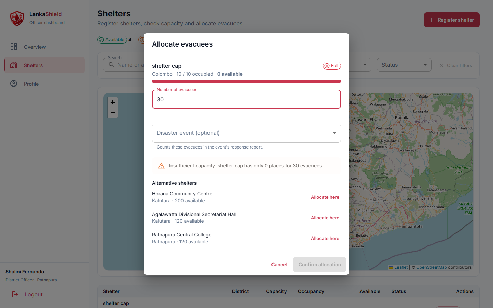
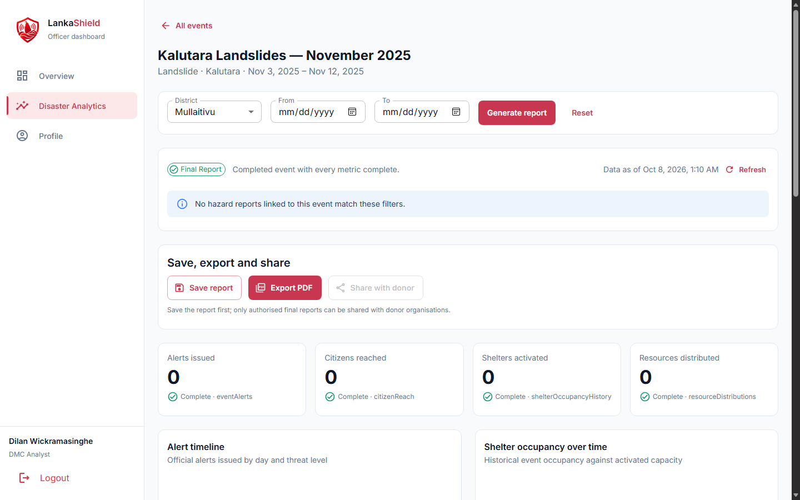
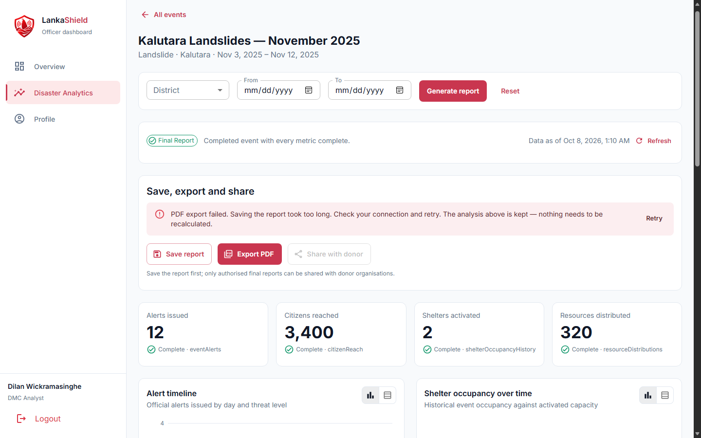

# LankaShield: Test Evidence (Phase 11)

This document records how LankaShield was tested: the automated test suites, the manual end-to-end checks and the manual failure tests required by Phase 11 of the development plan.

- **Automated tests** never touch the real Firebase project. Firebase calls are mocked (decision D5).
- **Manual tests** run against the shared Firebase project with the seeded demo data. Reset the data first with `npm run seed`; see [Feature_Test_Implementation.md](Feature_Test_Implementation.md#reset-the-demo-data-when-needed).
- Screenshots are stored in [`test-evidence/`](test-evidence/).

For the full list of feature tests by phase, see [Feature_Test_Implementation.md](Feature_Test_Implementation.md). This document covers only the Phase 11 requirements.

---

## 1. Automated tests

### How to run

```bash
npm test          # every workspace: shared, dashboard and mobile
npm run typecheck # also type-checks the test files
npm run lint
```

| Workspace | Runner | Location |
| --- | --- | --- |
| `packages/shared` | Vitest | `src/**/*.test.ts` |
| `apps/dashboard` | Vitest + React Testing Library (jsdom) | `src/**/*.test.tsx` |
| `apps/mobile` | Jest (`jest-expo`) + React Native Testing Library | `src/__tests__/*.test.tsx` |

Mobile tests live in `src/__tests__/` rather than next to the screens, because Expo Router treats every file under `src/app/` as a route.

### Latest run

| Workspace | Test files | Tests | Result | Date |
| --- | --- | --- | --- | --- |
| `packages/shared` | 12 | 99 | ✅ All passed | 8 Oct 2026 |
| `apps/dashboard` | 3 | 18 | ✅ All passed | 8 Oct 2026 |
| `apps/mobile` | 2 | 8 | ✅ All passed | 8 Oct 2026 |
| **Total** | **17** | **125** | ✅ | |

### Required unit tests

| Requirement | Where it is tested |
| --- | --- |
| Hazard-report Zod validation | `packages/shared/src/schemas/schemas.test.ts`: `hazardReportInputSchema` (valid report, every invalid field, more than three images, unsupported and oversized images, no evidence) |
| Duplicate / idempotent offline synchronisation | `packages/shared/src/rules/offlineSync.test.ts`: no duplicate when the report already reached Firestore, syncing twice creates it once, retry keeps the same tracking ID, other users' reports are not synced or overwritten |
| Verification transition rules | `packages/shared/src/rules/verification.test.ts`: outcome-to-status mapping, only pending reports accept a decision, a second decision fails with ALREADY_VERIFIED |
| Required rejection remarks | `schemas.test.ts` (`verificationDecisionInputSchema`), `verification.test.ts` (outcome rules), and the component test `DecisionForm.test.tsx` |
| Shelter available-capacity calculation | `packages/shared/src/rules/shelter.test.ts`: `calculateAvailableCapacity`, `deriveShelterStatus`, `toOccupancyRecord` |
| Insufficient-capacity handling | `shelter.test.ts`: `allocateEvacuees` throws INSUFFICIENT_CAPACITY, `findAlternativeShelters`; and the component test `AllocationDialog.test.tsx` |
| Final versus provisional report decision | `packages/shared/src/rules/analytics.test.ts`: `decideReportStatus`; and `AnalyticsReportPage.test.tsx` |
| Metric completeness calculation | `analytics.test.ts`: a failed source becomes a missing metric; and the incomplete-data banner in `AnalyticsReportPage.test.tsx` |

### Required component tests

| Requirement | Test file | What it checks |
| --- | --- | --- |
| Mobile report form validation | `apps/mobile/src/__tests__/ReportScreen.test.tsx` | An empty form shows all six validation messages and sends nothing. A complete form submits once with the tracking ID shown on screen and opens the result screen. A GPS failure message is shown. Offline, the button becomes "Save on this device". |
| Pending Sync status display | `apps/mobile/src/__tests__/QueuedReportCard.test.tsx` | A queued report shows **Pending Sync** and never "Pending Verification". A failed sync shows **Sync Failed**, the error and attempt count, Retry and Discard. While syncing the actions are hidden. Sync now while offline explains it will send automatically. |
| Verification decision dialog | `apps/dashboard/src/features/verification/DecisionForm.test.tsx` | A decision is required. Rejecting requires remarks. The only active event is pre-selected. Verifying needs no remarks. The ALREADY_VERIFIED error is shown when another officer decided first. |
| Shelter capacity warning | `apps/dashboard/src/features/shelters/AllocationDialog.test.tsx` | Preview after an allocation that fits. An insufficient-capacity warning with open alternatives, same district first, and closed shelters never offered. Allocate here switches shelter. "No open shelter can take…" when nothing fits. Invalid counts. The error when another officer filled the shelter first. |
| Analytics empty state and incomplete-data banner | `apps/dashboard/src/pages/AnalyticsReportPage.test.tsx` | Final report for complete data. The incomplete-data banner and Provisional status when a source fails. Empty states when no records match. A bad date range is rejected without recalculating. A failed PDF export keeps the analysis and offers Retry. A retried save reuses the same report ID. An unknown event shows "Event not found". |

---

## 2. Manual end-to-end checklist

Run each check with the phone (Expo Go) and the dashboard side by side. For each one, record the actual result, save a screenshot in `test-evidence/` and link it.

| ID | Check | Steps | Expected result | Actual result | Screenshot | Result |
| --- | --- | --- | --- | --- | --- | --- |
| E2E-1 | Mobile report appears in the verification queue | 1. Duty Officer opens **Verification Queue** on the web. 2. On the phone as `citizen.demo@example.com`, submit a Flood report with one photo. | The report appears in the queue **without a refresh**, with the same tracking ID, the citizen as reporter and evidence count 1. | | `test-evidence/E2E-1-queue.png` | |
| E2E-2 | Verification updates the mobile status and shows officer remarks | 1. Duty Officer opens the report from E2E-1 and records **Verify information** with a remark. 2. On the phone, open My Reports and the report details. | The phone shows **Verified** without restarting, "Officer remarks: …" on the details screen, a notification banner and badge. | | `test-evidence/E2E-2-mobile-verified.png` | |
| E2E-3 | Shelter allocation updates occupancy | 1. District Officer allocates `20` evacuees to an Available shelter. 2. Check the table and Overview. | The confirmation shows the new occupancy. The table row, status chip, map popup and Overview "Available shelter places" all update. | | `test-evidence/E2E-3-allocation.png` | |
| E2E-4 | Analytics uses the updated records | 1. In E2E-2, link the report to the active event when verifying. 2. DMC Analyst opens that event and clicks **Refresh**. | The "Data as of" time updates and the new report is counted in **Reports by day**, **Reports by hazard type** and **Verification outcomes** (Verified). | | `test-evidence/E2E-4-analytics.png` | |

---

## 3. Manual failure tests

F5, F6 and F7 were run on 8 Oct 2026 against the shared Firebase project. They used a headless Edge browser on the local dashboard (`npm run dashboard`) and did not change any data. The other tests need the phone.

| ID | Failure | Steps | Expected result | Actual result | Screenshot | Result |
| --- | --- | --- | --- | --- | --- | --- |
| F1 | Deny GPS permission | On the phone, deny location for Expo Go, open **Report Hazard** and tap **Use GPS**. | "Location permission was denied. Choose the hazard location on the map instead." "Choose on map" still works. | | `test-evidence/F1-gps-denied.png` | |
| F2 | Disable the network during mobile submission | Fill a report with 3 photos, tap **Submit report**, and turn on airplane mode while "Uploading photo…" shows. Then reconnect. | The report is not lost. It ends up "Saved on this device" (Pending Sync), then syncs **once** after reconnecting, with no duplicate in the queue. | | `test-evidence/F2-network-lost.png` | |
| F3 | Unsupported or oversized file | Pick a photo over 5 MB or a non-JPEG/PNG file from the gallery (e.g. a large PNG screenshot). | The image is rejected with "Each image must be 5 MB or smaller." or "Only JPEG or PNG images are allowed."; nothing is uploaded. The picker re-encodes most photos to JPEG, so a very large PNG is the easiest way to trigger it. | | `test-evidence/F3-file-rejected.png` | |
| F4 | Verify the same report twice | Open the same pending report in two browser tabs as the Duty Officer. Record a decision in tab A, then try in tab B. | Tab B switches to the recorded decision by itself, or shows "This report has already been reviewed by another officer." Only one decision is saved. | | `test-evidence/F4-second-decision.png` | |
| F5 | Allocate more evacuees than available capacity | As District Officer, open **Allocate** on a Full shelter and enter `30`. | An insufficient-capacity warning, alternative shelters with **Allocate here**, and **Confirm allocation** disabled. | "Insufficient capacity: shelter cap has only 0 places for 30 evacuees." Alternatives: Horana Community Centre (200 available), Agalawatta Divisional Secretariat Hall (120), Ratnapura Central College (120), each with Allocate here. Confirm allocation was disabled. Nothing was saved. |  | ✅ Pass |
| F6 | Filters that return no analytics records | As DMC Analyst, open **Kalutara Landslides — November 2025**, set District **Mullaitivu** and click **Generate report**. | Empty states instead of errors: an info message and "No data for these filters." on the charts. | "No hazard reports linked to this event match these filters." All four metrics showed 0 and all six charts showed "No data for these filters." See the observation below. |  | ✅ Pass |
| F7 | Simulate PDF export failure | On the same event, reset the filters, take the browser offline (DevTools → Network → Offline) and click **Export PDF**. | An error with **Retry**, and the analysis stays on screen. | After about 20 seconds: "PDF export failed. Saving the report took too long. Check your connection and retry. The analysis above is kept — nothing needs to be recalculated." with a **Retry** button. The metrics and charts stayed visible. |  | ✅ Pass |

### Observation: shelter allocations and analytics

Since the analytics rework, the shelter metric ("Shelters activated" and the occupancy chart) reads `shelterOccupancyHistory` records, and only the seed script creates them. Allocating evacuees (E2E-3) updates the shelter but does not add a history record, so a new allocation does not appear in analytics. Hazard reports still flow through, which is why E2E-4 checks the report charts. If allocations should count, the allocation transaction would also need to write an occupancy-history record.

### Observation from F6

With a district filter that matches nothing, the report is still labelled **Final Report** with every metric **Complete** at 0. This is consistent with the current rules: every data source loaded, and zero is the correct value for that filter. The team may prefer to label an empty filtered result differently. That's a design choice, not a defect.

---

## 4. Fault handling changed in Phase 11

| Change | Why |
| --- | --- |
| **Saving a response report is idempotent.** The report ID is chosen once per analysis run and reused on every save or export retry (`newResponseReportId`, `saveResponseReport({ responseReportId })`). | Found while preparing F7. Firestore keeps a timed-out write queued and sends it when the connection returns, so a Retry with a new ID would have created a duplicate saved report. Covered by the retry test in `AnalyticsReportPage.test.tsx`. |
| **Mobile form fields have accessibility labels** (`FormTextField` sets `accessibilityLabel` to the visible label). | React Native Paper's floating label isn't exposed to screen readers. This also lets the tests find fields by name. |
| **One copy of React for every workspace.** The root `package.json` overrides `test-renderer` to `~1.2.0`. | The newest `test-renderer` requires React 19.3 and would have installed a second React (the apps pin 19.2.3), which breaks hooks. |
